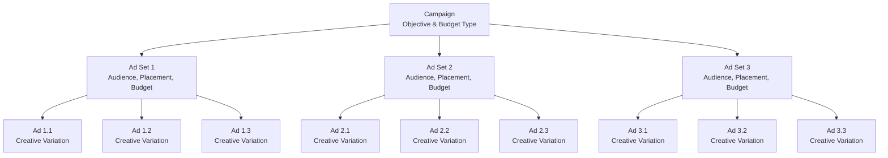

```markdown
# 📱 Facebook Campaign Setup Checklist

A comprehensive, step-by-step guide for setting up successful Facebook advertising campaigns. Perfect for beginners and a great reference for experienced marketers.

---

## 📋 Campaign Structure Overview

```

Campaign (Objective & Budget Type)
↓
Ad Sets(Audience, Placement, Budget)
↓
Ads(Creative, Copy, CTA)

```

## 🚀 Step-by-Step Setup Guide

### **Step 1: Campaign Level**

#### **I. Choose Campaign Objective**
Select based on your primary goal:
- **Conversions** (Purchases, Sign-ups)
- **Leads** (Form fills, Contact info)
- **Traffic** (Website visits)
- **Engagement** (Likes, Comments, Shares)

#### **II. Decide Budget Type**
| Type | Best For | Description |
|------|----------|-------------|
| **ABO** (Ad Set Budget Optimization) | Testing & Control | Budget set at ad set level |
| **CBO** (Campaign Budget Optimization) | Scaling & Efficiency | Budget set at campaign level |

#### **III. Naming Convention**
Use clear, descriptive names:
```plaintext
Format: "Objective – Audience – Date"
Example: "Lead Gen – Nigeria – Sept 2025"
```

---

Step 2: Ad Set Level

Audience Targeting

1. Location (Country, City, Radius)
2. Age & Gender (Demographics)
3. Detailed Interests/Behaviors
4. Custom Audiences (Email lists, Website visitors)
5. Lookalike Audiences (Based on buyers/leads)

Placements

· Automatic (Recommended for beginners)
· Manual (Choose specific placements):
  · Facebook Feed
  · Instagram Stories
  · Audience Network
  · Messenger

Budget & Schedule

· Set daily or lifetime budget
· Choose start and end date (or run continuously)

Optimization & Delivery

· Conversion location: Website, Messenger, App
· Optimization event: "Purchase", "Lead", "Add to Cart"

---

Step 3: Ad Level

Format Options

· Single Image
· Video
· Carousel (Multiple images/videos)

Creative Components

1. Headline – Short and punchy
2. Primary Text – Clear benefits and value proposition
3. Image/Video – High quality, engaging, relevant
4. Call-to-Action (CTA) – "Sign Up", "Learn More", "Shop Now"
5. Destination URL – Landing page, website, WhatsApp link

📊 Testing Recommendation

Test 3–5 creatives per ad set for optimal results.

---

Step 4: Review & Publish

Pre-Launch Checklist

· Double-check targeting parameters
· Verify budget allocation
· Review all creatives for quality
· Confirm tracking setup (Facebook Pixel/Conversion API)
· Test destination URLs

Post-Launch Best Practices

· Let campaign run 3–5 days before major changes
· Avoid restarting the learning phase unnecessarily
· Monitor performance daily but adjust cautiously

---

🎯 Pro Tips for Beginners

Starting Structure

```
1 Campaign
├── 3 Ad Sets (Different audiences)
│   ├── 3 Ads (Different creatives)
│   ├── 3 Ads
│   └── 3 Ads
├── 3 Ad Sets
└── 3 Ad Sets
```

Budget Strategy

· Start with ABO for testing (equal budget distribution)
· Switch to CBO for scaling winners (automatic optimization)

---

⚖️ CBO vs. ABO: Detailed Comparison

Campaign Budget Optimization (CBO)

Budget set at campaign level

· Facebook automatically distributes budget across best-performing ad sets
· Best for: Scaling, efficiency, less management

Example:

```
Campaign Budget: $100/day
├── Ad Set 1: $70 (Top performer)
├── Ad Set 2: $20 (Moderate performer)
└── Ad Set 3: $10 (Low performer)
```

Pros Cons
Efficient budget use May starve some ad sets
Ideal for scaling Less control over distribution
Less manual work Not ideal for equal testing

---

Ad Set Budget Optimization (ABO)

Budget set at ad set level

· You control exact budget for each audience
· Best for: Testing, control, fair comparisons

Example:

```
Campaign
├── Ad Set 1: $20/day
├── Ad Set 2: $20/day
└── Ad Set 3: $20/day
```

Pros Cons
Full control Less flexible for scaling
Fair testing More manual management
Equal delivery May miss optimization opportunities

---

✅ Best Practice Flow

Beginner's Roadmap

1. Phase 1: Testing
   · 1 Campaign → 3 Ad Sets (different audiences) → 3 Ads per set
   · Use ABO for equal testing
   · Run for 5-7 days
2. Phase 2: Scaling
   · Identify winning ad set + ad combination
   · Create new campaign with CBO
   · Focus budget on proven performers
   · Expand audiences (Lookalikes, Broad targeting)

---

📈 Visual Structure Diagram



---

🔧 Quick Reference Table

Stage Key Decision Recommendation
Campaign Objective Choose based on business goal
Campaign Budget Type Start with ABO, scale with CBO
Ad Set Audience Test 3 different approaches
Ad Set Placements Automatic for beginners
Ad Creatives Test 3-5 variations
Ad Testing Run 3-5 days before changes

---

📝 Summary Checklist

Before Launch

· Campaign objective aligned with goals
· Budget type selected (ABO for testing)
· Clear naming convention used
· Audiences properly defined
· Placements selected
· Creatives tested (3-5 variations)
· Tracking verified

After Launch

· Monitor for 3-5 days
· Avoid frequent changes
· Analyze performance data
· Scale winners with CBO

---

🏷️ Tags

#facebook-ads #digital-marketing #advertising #social-media #beginners-guide #marketing-checklist

---

Last Updated: October 2024
Recommended For: Facebook Ads beginners to intermediate users

---

For updates or contributions, please submit a pull request or open an issue on GitHub.
